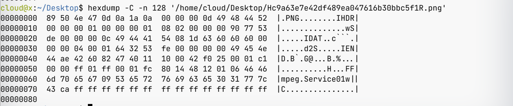

# FFmpeg下载伪装成图片视频（old）

**使用 FFmpeg 下载伪装成图片的 m3u8 视频**

## 前言

最近看到一个不错的视频，想要下载到本地收藏起来，免得哪天网址失效无法播放。但是使用 FFmpeg 下载的时候报了个错

```
[hls,applehttp @ 0x55efcdf226c0] Could not find codec parameters for stream 0 (Video: png, none(pc)): unspecified size
Consider increasing the value for the 'analyzeduration' and 'probesize' options
Input #0, hls,applehttp, from 'https://pv.xbottle.top/demo/rick.m3u8':
  Duration: 00:03:32.44, bitrate: 0 kb/s
  Program 0 
    Metadata:
      variant_bitrate : 0
    Stream #0:0: Video: png, none(pc), 25 tbr, 25 tbn, 25 tbc
    Metadata:
      variant_bitrate : 0
Output #0, mp4, to 'rick.mp4':
Output file #0 does not contain any stream
```
PNG ？？网页里明明可以播放的。下载了其中一个片段，打开后发现真的是一张图片。使用 hexdump 查看了一下，文件最开始确实是 PNG 图片，但是紧接着就看到了 FFmpeg Service01 字样，确认了这个文件是由一张图片和一段视频拼接而成。

Google 了一下，找到两篇文章 [1] [2]。讲的是通过在视频前加一个小的 PNG 图片来伪装成图片骗过图床的校验，hls.js 在播放时会自动忽略前边的图片。但 FFmpeg 没有相关处理，把伪装后的视频识别成了图片导致下载失败。

## 解决思路
知道了问题的原因，解决思路就有了。但是实际操作过程中遇到了很多问题，这里记录一下。
## 第一次尝试（失败）
首先想到的就是给 m3u8 中每个片段指定格式，但是翻阅 FFmpeg 文档后没有找到相关参数，只找到了 hls 格式中一个参数 `seg_format_options` [3], 根据描述猜测是解析视频片段时的一些参数，尝试搭配 `skip_initial_bytes` 参数使用。结果还是报错
```bash
ffmpeg -f hls -seg_format_options skip_initial_bytes=8 -i https://pv.xbottle.top/demo/rick.m3u8 -c copy output.mp4
```
由于这个参数是最近才添加的，翻遍全网都没找到更详细的描述，故放弃此方法。
## 第二次尝试（成功）

既然指定格式行不通了，那我们还可以屏蔽 FFmeg 对图片格式的检测。但是 FFmpeg 文档里也没有找到相关参数（笑哭😂）。这里我们可以通过自己编译来屏蔽图片格式支持。下面是编译过程：
```bash
git clone --depth=1 https://github.com/FFmpeg/FFmpeg.git
cd FFmpeg
./configure --disable-doc --disable-asm --disable-x86asm --enable-openssl --enable-protocols --enable-protocol=https --disable-demuxer=image*
make -j4
```
使用自己编译的 FFmpeg 尝试下载，果然成功了。

## 第三次尝试（成功）

在查找资料的过程中，发现 m3u8 语法中有一个标签 `EXT-X-BYTERANGE` [4]，可以读取指定范围的视频片段，语法为：`#EXT-X-BYTERANGE:<读取内容长度>[@<起始位置偏移量>]`。由于只要要破坏 PNG 格式头就可以使 FFmpeg 识别到正确的视频，偏移 8 字节足够了。这里我们把参数设置为 `100000000@8`。下载脚本如下：
```bash
# 手动下载 m3u8 文件
wget https://pv.xbottle.top/demo/rick.m3u8
# 给每一个视频片段都加上截取范围
sed -i '/#EXTINF:*/a\#EXT-X-BYTERANGE:100000000@8' ./rick.m3u8
# 开始下载
ffmpeg -protocol_whitelist file,http,https,tls,tcp -i ./rick.m3u8 -c cooy output.mp4
```
虽然可以下载，但是由于不知道每个视频片段具体大小，使用了写死的 100000000，FFmpeg 下载时会卡好久，不是一个完美的方案，故不推荐。

## 后记
虽然尝试成功了两次，但是做法都不是太优雅，还是希望 FFmpeg 官方可以增强对 hls 自定义设置的支持，如可以强制指定片段格式等。可以通过一条命令成功下载


